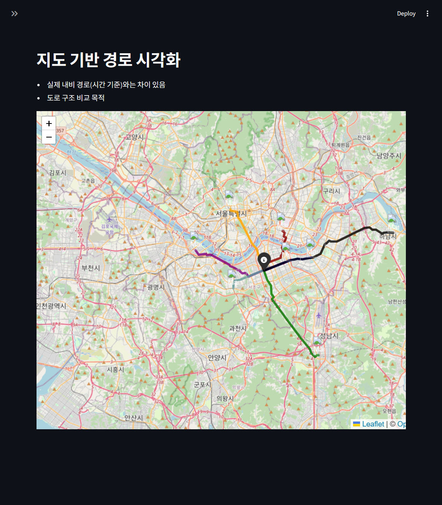
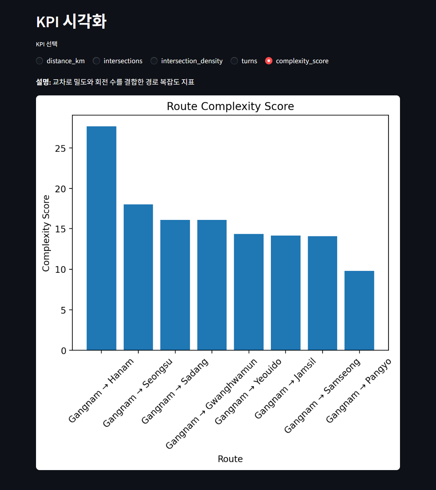
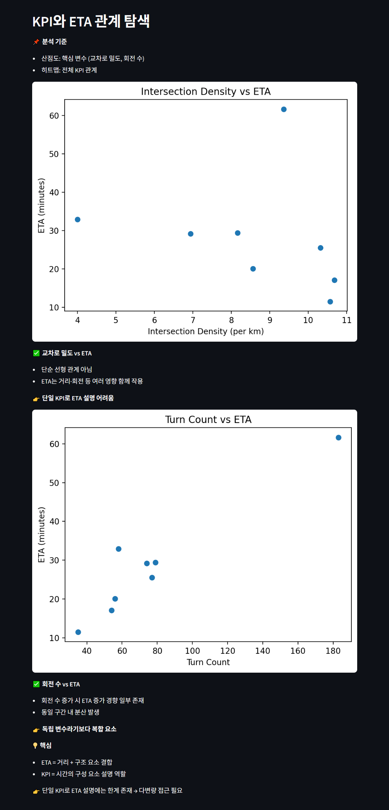

# 🚗 도로 구조 기반 KPI 및 ETA 분석  
**강남 출발 경로 분석 프로젝트**
  
<br>
  
---  
  
## 📌 Overview
기존 내비게이션은 주로 거리 및 시간 중심으로 경로를 평가하지만,  
경로의 주행 난이도나 구조적 복잡도는 충분히 반영되지 않는 한계가 있습니다.  
  
본 프로젝트는 OpenStreetMap(OSM) 데이터를 활용하여  
**강남 출발 주요 경로의 도로 구조 특성**을 분석하고,  
  
단순 거리/시간 중심 분석이 아닌  
- 교차로 밀도  
- 회전 수  
- 경로 복잡도  
  
와 같은 **도로 구조 KPI**를 정의하여  
  
- 각 경로의 주행 특성을 정량적으로 비교하고  
- 도로 구조 요소가 ETA에 미치는 영향을 탐색적으로 분석하며  
- 내비게이션 서비스 적용 가능성을 제시하는 것을 목표로 합니다.  
  
<br>
  
---  
  
## 🎯 Objectives
- 도로 구조 KPI 정의 및 정량화  
- KPI 기반 경로 특성 분석  
- 구조 기반 ETA 시뮬레이션 모델 설계  
- 내비게이션 서비스 활용 가능성 탐색  
  
<br>
  
---  
  
## 📁 프로젝트 구조  
```text
navigation-route-analysis/
├─ app/
│ └─ navigation.py              # Streamlit 대시보드
├─ data/
│ └─ route_kpi_analysis.csv     # 분석 저장 데이터
├─ notebooks/
│ └─ route_analysis.ipynb       # 분석 노트북
├── screenshots/
│ └─ ...(주요 스크린샷 포함)
├─ .gitignore
├─ README.md
└─ requirements.txt  
```
  
<br>  
  
---  
  
## 프로젝트 흐름
```text
목표 정의
      ↓
데이터 수집 및 전처리
      ↓
KPI 설계
      ↓
KPI 분석 및 시각화
      ↓
ETA 시뮬레이션
      ↓
인사이트 도출 및 서비스 적용
```

<br>  
  
---  
  
## 🗺️ 데이터 및 방법론  
  
### 1. 도로 네트워크 구축
- 데이터: OpenStreetMap (OSM)  
- 범위: 강남역 기준 반경 20km  
- 사용 라이브러리: `osmnx`, `networkx`  
- 경로 산출 기준: 거리 기반 최단 경로 (Shortest Path)  
  
👉 서울 주요 업무지구 및 외곽을 포함하는 분석 범위 설정  
  
<br>
  
### 2. 분석 경로 정의  
강남 → 주요 지역 경로 설정  
  
- 업무지구: 여의도, 광화문  
- 도심: 성수, 사당  
- 상업지구: 잠실, 삼성  
- 외곽: 판교, 하남  
  
👉 도심 / 준도심 / 외곽 경로를 모두 포함  
  
<br>
  
### 3. KPI 정의  
  
| KPI | 설명 |
|-----|------|
| Distance | 경로 총 거리 (km) |
| Intersections | degree ≥ 3 노드 수 |
| Intersection Density | km당 교차로 수 |
| Turns | ±30° 이상 방향 변화 |
| Complexity Score | 밀도 + (회전 수 × 가중치) |
  
👉 도로 구조를 기반으로 **주행 난이도 및 경로 복잡도 정량화**  
  
- 회전 정의는 각도 기반 단순화 모델로, 실제 내비게이션 로직과 차이가 있을 수 있음
  
<br>
  
---  
    
## 🧠 핵심 아이디어  
  
> ETA는 단순 거리뿐 아니라 다양한 도로 구조 요소의 영향을 함께 받는다. 
   
<br>
  
---  
  
## ⏱️ ETA 시뮬레이션 모델
  
본 프로젝트에서는 실제 교통 데이터 대신  
**도로 구조 요소 기반 ETA 시뮬레이션 모델**을 설계하였습니다.  
  
```python
ETA = 거리 기반 이동 시간
    + (교차로 × 지연)
    + (좌회전 × 지연)
    + (우회전 × 지연)
```
  
**특징**  
- 좌/우회전 분리 반영  
- 교차로 지연 포함  
- 실제 ETA 예측 모델이 아닌 **구조 영향 분석을 위한 시뮬레이션 모델**  
  
<br>  
  
---  
  
## 📊 주요 결과  
  
### 1. 경로 유형별 구조적 차이  
  
- **도심 경로**  
  - 교차로 밀도 높음  
  - 회전 수 많음 → 복잡도 높음  
  
- **간선도로 중심 경로**  
  - 교차로 밀도 낮음  
  - 직선 비중 높음 → 구조 단순  
  
👉 경로별로 도로 구조 특성 차이가 확인됨
  
<br>  
  
### 2. ETA 해석  
  
- 거리 → ETA에 가장 큰 영향  
- 동시에 교차로 및 회전 수는 추가적인 지연 요소로 작용 
  
👉 KPI를 통해 **ETA를 설명하는 구조적 요소 해석 가능**  
  
<br>  
  
### 3. 복잡도 지수 (Complexity Score)
  
- 교차로 밀도 + 회전 수 결합한 지표  
- 경로의  
  - 운전 난이도  
  - 안내 복잡도  
  
를 하나의 지표로 표현 가능  
  
<br>  
  
---  
  
## 📈 Streamlit 대시보드
  
본 프로젝트는 Streamlit 기반 대시보드로 구현하였으며,  
라디오 버튼을 통해 KPI를 선택하면 해당 KPI에 맞는 차트를 확인할 수 있습니다.    
  
### 🗺️ 지도 기반 경로 시각화 (Folium)  
아래는 Streamlit에서 구현한 지도 시각화 예시입니다.  

  
<br>

### 📊 KPI 시각화
경로별 KPI 비교를 Streamlit 차트로 확인할 수 있습니다.  
  
  
<br>

### 🔍 KPI-ETA 관계 분석
Streamlit에서 확인 가능한 주요 KPI-ETA 산점도 예시입니다.
  
  
<br>
  
---  
    
## 💡 서비스 활용 방안  
  
### 1. 다중 기준 경로 추천  
  
기존:  
- 최단 거리 / 최소 시간 중심  
  
확장:  
- **Fast** → ETA 최소화  
- **Simple** → Complexity 최소화  
- **Balanced** → ETA + Complexity  
  
```python
Route Score = ETA + α × Complexity
```
  
👉 다양한 기준을 반영한 경로 추천 전략 설계 가능  
  
<br>
  
### 2. ETA 보정 로직  
  
기존 ETA:  
- 거리 + 평균 속도 중심  
  
확장:  
- 교차로 지연 반영  
- 좌/우회전 지연 반영  
  
👉 도심 환경에서 ETA 정확도 개선 가능  
(단, 실제 서비스 적용을 위해서는 교통 데이터 추가 필요)  
  
<br>
  
### 3. 경로 유형 기반 안내  
  
- Urban (도심형)  
- Highway (단순 경로)  
- Mixed (혼합형)  
  
👉 사용자에게 **경로 특성 설명 가능**  
  
<br>  
  
### 4. 신규 KPI 제안  
  
**Navigation Complexity Index (NCI)**  
  
- 경로 복잡도 기반 지표  
- 활용:  
  - 경로 특성 모니터링  
  - 서비스 품질 관리  
  
<br>
  
---  
    
## ⚠️ 한계  
- 실시간 교통 데이터 미반영  
- 경로 샘플 수 제한 (소수 경로 비교)  
- 거리 차이를 통제하지 못해 KPI 영향 분리 한계 존재
- ETA는 시뮬레이션 기반으로 실제 값과 차이 존재    
  
<br>
  
---  
  
## 🚀 향후 개선 방향  
- 교통량 및 속도 데이터 결합  
- 동일 거리/조건 기반 비교 실험 설계  
- 데이터 기반 ETA 모델 고도화  
- 경로 샘플 확장 및 일반화 검증 
- 실제 내비게이션 서비스 적용 검증  
  
<br>  
  
---  
  
## 📌 결론
  
본 프로젝트는 도로 구조 KPI를 통해  
경로 간 차이를 정량적으로 비교하고,  
  
ETA를 단순 결과 값이 아닌  
구조적 요소의 조합으로 해석할 수 있는 가능성을 확인하였습니다.  
  
또한 이러한 KPI는  
경로 추천 및 ETA 보정 로직 설계에 활용 가능한  
**구조 기반 지표 정의 가능성**을 확인하였습니다.  
  
<br>
  
---  
  
## 🛠️ Tech Stack
- Python  
- osmnx  
- networkx  
- pandas  
- matplotlib / seaborn  
- folium  
- Streamlit  
  
<br>
  
---  
  
## 🔥 한 줄 요약
  
**“도로 구조 KPI를 정의하고, 이를 기반으로 경로 특성과 ETA 구성 요소를 분석한 내비게이션 경로 분석 프로젝트”**  
  
<br>
  
---
  
## 실행 방법
```python
# 1. 가상환경 생성 및 활성화
python -m venv venv
source venv/bin/activate   # Windows: venv\Scripts\activate

# 2. 필요 라이브러리 설치
pip install -r requirements.txt

# 3. Streamlit 실행
streamlit run app/navigation.py
```